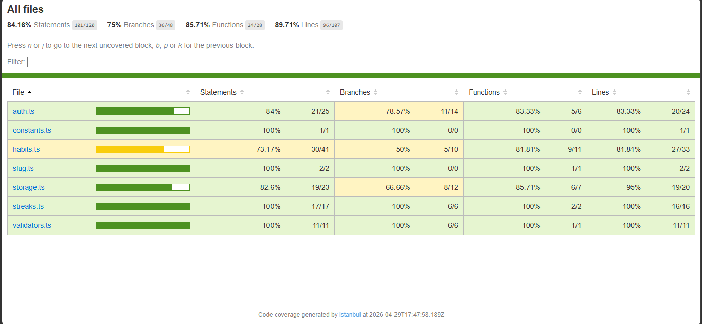
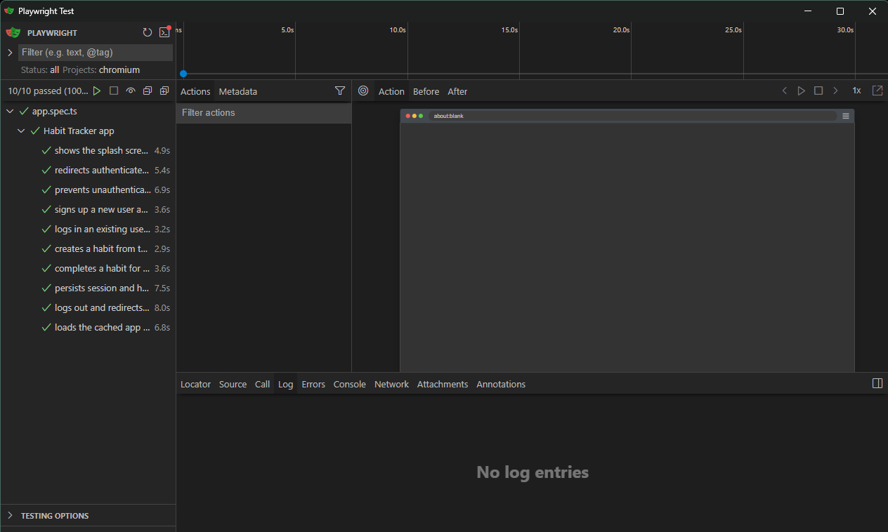

# Habit Tracker PWA

A mobile-first Progressive Web App for tracking daily habits. Built with Next.js, React, TypeScript, and Tailwind CSS. All data is persisted locally using `localStorage` — no backend or external authentication service required.

---

## Project Overview

The Habit Tracker PWA allows users to:

- Sign up and log in with email and password
- Create, edit, and delete daily habits
- Mark habits as complete or incomplete for today
- View a live streak count for each habit
- Install the app on their device as a PWA
- Use the cached app shell offline after the first load

This project was built as a Stage 3 technical execution task, implementing a full specification from a Technical Requirements Document. The focus is on deterministic behavior, correct structure, testability, and adherence to the specification.

---

## Tech Stack

- **Framework:** Next.js 15 (App Router)
- **Language:** TypeScript
- **Styling:** Tailwind CSS
- **Persistence:** localStorage (no remote database)
- **Unit/Integration Tests:** Vitest + React Testing Library
- **End-to-End Tests:** Playwright

---

## Setup Instructions

### Prerequisites

- Node.js v18 or higher
- npm v9 or higher

### Install Dependencies

Clone the repository and install:

```bash
git clone https://github.com/HopeAda/HNG14-Stage-Three
cd task-3-habit-tracker
npm install
```

Install Playwright browsers for E2E tests:

```bash
npx playwright install
```

---

## Run Instructions

### Start Development Server

```bash
npm run dev
```

Visit `http://localhost:3000` in your browser. The app opens on the splash screen and redirects to `/login` if no session exists.

### Build for Production

```bash
npm run build
npm run start
```

---

## Test Instructions

### Run All Tests

```bash
npm run test
```

This runs unit tests, integration tests, and E2E tests in sequence.

### Run Unit Tests Only (with coverage)

```bash
npm run test:unit
```

Runs all tests in `src/tests/unit/` and generates a coverage report. Coverage is scoped to `src/lib/` and must meet the 80% line coverage threshold.

### Run Integration Tests Only

```bash
npm run test:integration
```

Runs all tests in `src/tests/integration/` using Vitest and React Testing Library.

### Run E2E Tests Only

```bash
npm run test:e2e
```

Runs all Playwright tests in `src/tests/e2e/`. The dev server starts automatically before the tests run and shuts down after.

### View Coverage Report

After running `npm run test:unit`, open the HTML coverage report:

```
coverage/index.html
```

Open this file in your browser for a full line-by-line coverage breakdown.

---

## Local Persistence Structure

All data is stored in the browser's `localStorage` under three keys:

### `habit-tracker-users`

Stores a JSON array of registered users.

```json
[
	{
		"id": "uuid-string",
		"email": "user@example.com",
		"password": "plaintext-password",
		"createdAt": "2024-01-01T00:00:00.000Z"
	}
]
```

### `habit-tracker-session`

Stores the currently logged-in user's session, or `null` when logged out.

```json
{
	"userId": "uuid-string",
	"email": "user@example.com"
}
```

### `habit-tracker-habits`

Stores a JSON array of all habits across all users. Each habit is filtered by `userId` when loaded on the dashboard.

```json
[
	{
		"id": "uuid-string",
		"userId": "uuid-string",
		"name": "Drink Water",
		"description": "Stay hydrated",
		"frequency": "daily",
		"createdAt": "2024-01-01T00:00:00.000Z",
		"completions": ["2024-01-01", "2024-01-02"]
	}
]
```

`completions` contains unique calendar dates in `YYYY-MM-DD` format. Duplicate dates are not allowed.

---

## PWA Implementation

The app is installable as a Progressive Web App and supports basic offline usage.

### How it works

**`public/manifest.json`**
Defines the app name, icons, theme color, display mode (`standalone`), and start URL. The browser reads this to enable the install prompt.

**`public/sw.js`**
A cache-first service worker that:

- On `install`: caches the app shell (routes and static assets)
- On `activate`: removes outdated caches
- On `fetch`: serves cached responses first, falls back to the network, and caches new responses dynamically

**`src/components/shared/ServiceWorkerRegistration.tsx`**
A client component mounted in `layout.tsx` that registers `sw.js` on app load using `navigator.serviceWorker.register('/sw.js')`. Because service worker registration requires browser APIs, it runs inside a `useEffect` hook.

**Offline behavior**
Once the app has been loaded at least once, the service worker caches the app shell. On subsequent visits without a network connection, the cached shell is served and the app renders without a hard crash.

---

## Trade-offs and Limitations

**Passwords stored in plaintext**
Since this is a front-end-only project with no backend, passwords are stored as plain strings in `localStorage`. This is intentional for the scope of this stage and would never be acceptable in a production app. A real implementation would hash passwords and use a secure authentication service.

**localStorage is not secure**
Any JavaScript running on the page has access to `localStorage`. For a real product, sensitive data like sessions and user credentials would be stored server-side with HTTP-only cookies.

**No cross-device sync**
Data lives only in the browser that created it. Clearing browser data or switching devices loses all habits and accounts.

**Streak logic**
The streak counter counts backwards from today if today is completed, or from yesterday if today has not been marked yet. This keeps the streak alive until the day is actually missed rather than resetting at midnight.

**Single frequency support**
Only `daily` frequency is implemented as specified in the TRD. Weekly or custom frequencies are not supported in this stage.

---

## Test File Map

This section maps each required test file to the behavior it verifies.

### `src/tests/unit/slug.test.ts`

Verifies the `getHabitSlug()` utility function in `src/lib/slug.ts`.

- Confirms basic names are converted to lowercase hyphenated slugs
- Confirms leading/trailing spaces are trimmed and internal repeated spaces collapse to a single hyphen
- Confirms non-alphanumeric characters except hyphens are removed

### `src/tests/unit/validators.test.ts`

Verifies the `validateHabitName()` utility function in `src/lib/validators.ts`.

- Confirms empty names are rejected with the correct error message
- Confirms names over 60 characters are rejected with the correct error message
- Confirms valid names are trimmed and returned as the normalized value

### `src/tests/unit/streaks.test.ts`

Verifies the `calculateCurrentStreak()` utility function in `src/lib/streaks.ts`.

- Confirms an empty completions array returns a streak of 0
- Confirms that if today is not completed the streak does not count today
- Confirms consecutive completed days produce the correct streak count
- Confirms duplicate dates in completions are ignored
- Confirms a gap in consecutive days breaks the streak

### `src/tests/unit/habits.test.ts`

Verifies the `toggleHabitCompletion()` utility function in `src/lib/habits.ts`.

- Confirms a date is added to completions when not already present
- Confirms a date is removed from completions when already present
- Confirms the original habit object is not mutated
- Confirms no duplicate dates appear in the returned completions array

### `src/tests/integration/auth-flow.test.tsx`

Verifies the `LoginForm` and `SignupForm` React components against real localStorage behavior.

- Confirms signup writes a session to localStorage and the user is created
- Confirms duplicate email signup shows the correct error message in the DOM
- Confirms login with valid credentials writes a session to localStorage
- Confirms login with invalid credentials shows the correct error message in the DOM

### `src/tests/integration/habit-form.test.tsx`

Verifies the `HabitForm` and `HabitCard` React components against real localStorage behavior.

- Confirms submitting with an empty name shows the validation error in the DOM
- Confirms a new habit is saved to localStorage and the list updates
- Confirms editing a habit updates name and description while preserving id, userId, createdAt, completions, and frequency
- Confirms the delete confirmation dialog appears before deletion and the habit is removed after confirmation
- Confirms toggling completion updates the streak display immediately and saves to localStorage

### `src/tests/e2e/app.spec.ts`

Full end-to-end tests running in a real Chromium browser via Playwright against the live dev server.

| Test                                                                       | What it verifies                                                                             |
| -------------------------------------------------------------------------- | -------------------------------------------------------------------------------------------- |
| shows the splash screen and redirects unauthenticated users to /login      | Splash renders with app name, then redirects to /login when no session                       |
| redirects authenticated users from / to /dashboard                         | Splash redirects to /dashboard when a valid session exists                                   |
| prevents unauthenticated access to /dashboard                              | Direct visit to /dashboard without a session redirects to /login                             |
| signs up a new user and lands on the dashboard                             | Signup form creates user and session, redirects to dashboard                                 |
| logs in an existing user and loads only that user's habits                 | Login loads only the habits belonging to the authenticated user                              |
| creates a habit from the dashboard                                         | Habit form creates a habit, closes modal, renders card in list                               |
| completes a habit for today and updates the streak                         | Toggle button marks today complete, streak increments immediately, persisted to localStorage |
| persists session and habits after page reload                              | After reload, user stays on dashboard and habits are still visible                           |
| logs out and redirects to /login                                           | Logout clears session from localStorage and redirects to /login                              |
| loads the cached app shell when offline after the app has been loaded once | After first load, going offline still renders the app without a crash                        |

---

## Folder Structure

```
src/
  app/
    globals.css
    layout.tsx
    page.tsx
    login/page.tsx
    signup/page.tsx
    dashboard/page.tsx
  components/
    auth/
      LoginForm.tsx
      SignupForm.tsx
    habits/
      HabitForm.tsx
      HabitList.tsx
      HabitCard.tsx
    shared/
      SplashScreen.tsx
      ProtectedRoute.tsx
  lib/
    auth.ts
    habits.ts
    storage.ts
    streaks.ts
    slug.ts
    validators.ts
    constants.ts
  types/
    auth.ts
    habit.ts
public/
   icons/
   icon-192.png
   icon-512.png
   manifest.json
   sw.js
tests/
   unit/
   slug.test.ts
   validators.test.ts
   streaks.test.ts
   habits.test.ts
   integration/
   auth-flow.test.tsx
   habit-form.test.tsx
   e2e/
   app.spec.ts
```

---

## Live Demo

https://hng-14-stage-three.vercel.app/

## Coverage Report



## Playright Test Result


